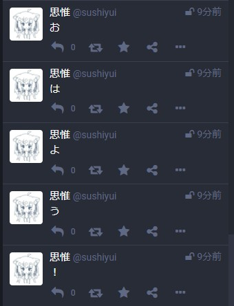
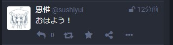

トゥートで遊べる。  
ltlを荒らしてしまう原因になるので、ltlには流れないようになっています。

.env.sample

```
SERVER="https://mstdn.jp/api/v1/statuses?access_token="
TOKEN="お前のTOKEN"
```

is_splitのbool値によって動作が変わります。  
trueの場合は、分割トゥートになります。  
例



falseの場合は、通常トゥートになります。



### usage

```bash

$ node mascha.js

文字列を入力してください: おはよう！
入力された文字列: おはよう！

~~~
logが表示される
~~~

```